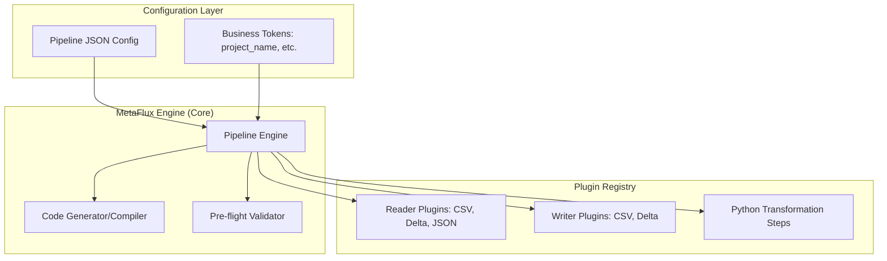

# 🌊 MetaFlux

[](https_link_to_license)
[](https://www.python.org/downloads/)
[](https://spark.apache.org/docs/latest/api/python/index.html)

**MetaFlux** is a high-performance, metadata-driven orchestration framework designed for scalable PySpark ETL pipelines. It allows Data Engineers to decouple the "What" (data logic) from the "How" (execution engine) by using simple,-declarative JSON configurations.

---

## 🌟 Key Features

*   🚀 **Metadata-Driven**: Define entire lifecycles—from ingestion to final sink—using structured JSON.
*   🔗 **Automated DAG Resolution**: Uses `TopologicalSorter` to automatically resolve complex dependency chains via `ref()` functions.
 
*   🔌 **Plug-and-Play Architecture**: Add new data sources (Snowflake, BigQuery) or writers simply by dropping a class into the `reader_plugins.py` or `writer_plugins.py` modules.
*   🧬 **Hybrid Transformations**: Seamlessly switch between high-level **SQL** statements and custom,-complex **Python** transformation functions.
*   🛠 **Template Power**: Built on **Jinja2**, allowing users to inject business tokens (like `project_name`) or dynamic date utilities (`today()`, `yesterday()`) directly into SQL queries.
*   🔍 **Observability**: Deeply integrated context-aware logging that tracks exactly which module and method is processing your data.

---

## 🏗 Architecture

MetaFlux uses a decoupled architecture where the Engine manages the lifecycle, and Plugins manage the data connectivity.


hands-on usage-example

1. Define your Pipeline (pipeline_config.json)
The configuration defines the flow of data through your-system.
```json
{
  "reader": {
    "groceries_ds": {
      "type": "csv_batch",
      "path": "test_data_input.csv",
      "view_name": "vw_groceries"
    }
  },
  "transformation": {
    "add_metadata": {
      "type": "sql_step",
      "query": "select *, '{{ project_name }}' as project FROM {{ ref('vw_groceries') }}",
      "view_name": "vw_final",
      "depends_on": ["vw_groceries"]
    }
  },
  "writer": {
    "w1": {
      "write_view_name": "vw_final",
      "type": "csv_batch",
      "path": "test_output_folder",
      "mode": "overwrite"
    }
  },
  "tokens": [
    {"name": "project_name", "value": "grocery_analytics"}
  ]
}

```
2. Execute the Pipeline
Run the provided test script to see the engine in-action. This will initialize Spark, load your configuration, resolve the dependencies, and execute the transformation.
```bash
python test_pipeline.py
```
🛠 Developer Guide: Extending MetaFlux
The power of MetaFlux lies in its extensibility. You do not need to modify the core engine to support new data formats.

Adding a New Reader (e.g., Snowflake)
Simply add a class to src/core/reader_plugins.py that inherits from AbstractReader. The-engine will auto-discover it at runtime.
```python
from framework_core.interfaces import AbstractReader

class SnowflakeReader(AbstractReader):
    def read(self, spark, config, context):
        # Implementation for snowflake connection...
        return spark.read.format("snowflake").options(...).load()

```
